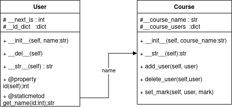

<h1>Задание</h1>
Вы оказались в стартапе. Здесь то и дело говорят о новом продукте - LMS. Но чтобы инвестор смог поверить в продукт, вас попросили реализовать минимально жизнеспособный продукт (mvp).

Продукт предусматривает возможность:
- создавать пользователей системы,
- создавать курсы, на которые пользователи будут зачисляться,
- производить зачисление на курс
- выставлять по курсу итоговую оценку для каждого учащегося.

Вам необходимо:
1. Продумать UML-диаграмму для вашего mvp LMS.
2. Реализовать все необходимые сущности (поля и методы можно вводить самые необходимые для работы системы).
3. Показать пример создания пользователя, создания курса, зачисление на курс пользователя и проставление итоговой оценки пользователю по курсу.
p.s. В код можно добавить ссылку на UML-диаграмму (картинку). Возможно так же в качестве результата прислать ссылку на github.

<h1>Реализация</h1>
Разработанныы два класса User и Course

У экземпляров класса User есть уникальный id и имя. Для возможности получения имени по id есть статический словарь __id_dict.

У экземпляров класса Course есть атрибут course_name  и словарь course_users в котором хранятся id и оценки пользователей записанных на курс.

Классы связаны через статический метод User.get_name предназаначенный для получениия имени епользователя по id.(Не уверен что это верно отображенно на UML диаграмме) 

​
